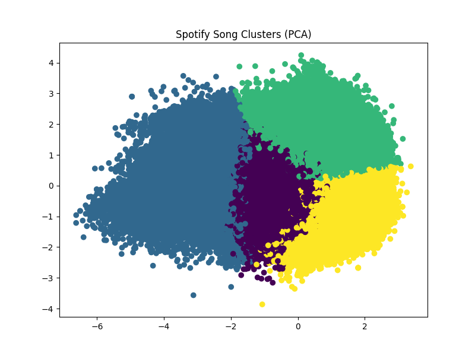
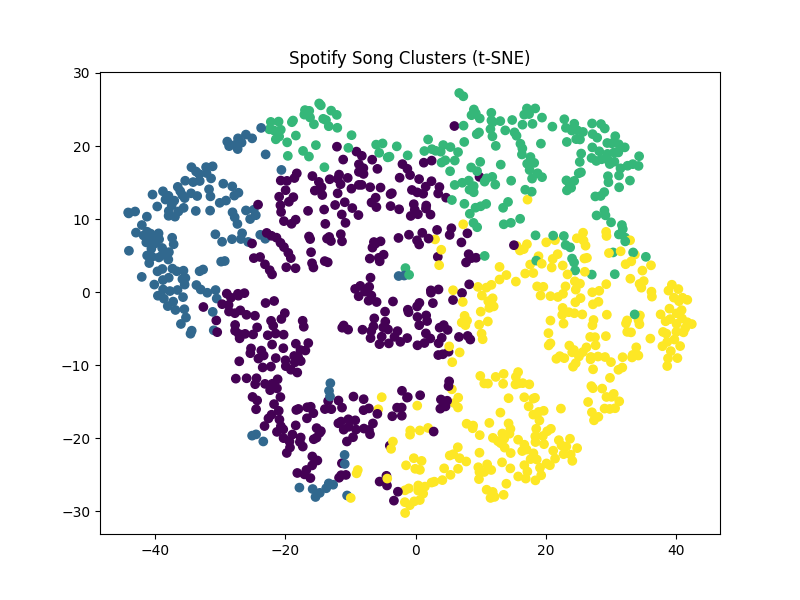

# 🎧 Spotify Music Clustering using Machine Learning

## 📌 Project Overview
This project performs **music clustering on Spotify songs** using machine learning techniques.  
Songs are grouped based on their **audio features** such as danceability, energy, tempo, loudness, and valence.

The clustering is done using the **K-Means Clustering algorithm**, and the results are visualized using **PCA** and **t-SNE** dimensionality reduction techniques.

---

## 📂 Dataset
Dataset used in this project is from Kaggle:

Spotify Tracks Dataset

It contains thousands of songs along with their audio characteristics extracted from the Spotify API.

---

## 🎵 Features Used
The following audio features are used for clustering:

- Danceability
- Energy
- Tempo
- Loudness
- Valence

These features describe the **musical characteristics and mood of songs**.

---

## 🤖 Machine Learning Algorithm
This project uses **K-Means Clustering**, an unsupervised learning algorithm that groups similar data points together.

Steps involved:
1. Data preprocessing
2. Feature selection
3. Feature normalization
4. Finding optimal number of clusters (Elbow Method)
5. Applying K-Means clustering

---

## 📊 Visualization Techniques

To visualize clusters we used:

- PCA (Principal Component Analysis)

- t-SNE (t-Distributed Stochastic Neighbor Embedding)

These techniques reduce high dimensional data into **2D visualization**.

---
## Cluster Visualization

### PCA Visualization

### t-SNE Visualization

## ⚙️ Tools & Technologies

- Python
- Pandas
- NumPy
- Matplotlib
- Seaborn
- Scikit-learn
- Google Colab

---

## 📈 Results
The model successfully groups songs into clusters based on their audio characteristics.

Example clusters include:
- High energy dance songs
- Calm and relaxing songs
- Emotional songs
- Party / upbeat songs

This type of clustering is used by music streaming platforms like Spotify to improve **music recommendation systems**.

---

## 🚀 How to Run the Project

1. Clone the repository
2. Open the notebook in Google Colab
3. Upload the dataset
4. Run the notebook cells step by step

---

## 📁 Project Structure
spotify-music-clustering
│
├── spotify_clustering.ipynb
├── SpotifyFeatures.csv
├── README.md
---

## 🎯 Future Improvements
- Add music recommendation system
- Build a web app using Streamlit
- Improve clustering using additional features

---

## 👨‍💻 Author
Machine Learning Mini Project
